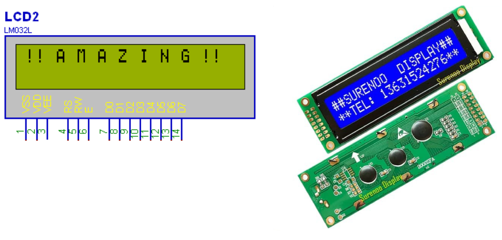

# Experiment 4

In this series of experiments, we will work with LCDs.

Liquid crystal displays, or LCDs, are tools for displaying information that unlike 7Segs, which can only display specific characters, can display any type of character, letters, numbers, and symbols, or even user-defined and characters.
But this variety of displays makes working with LCDs a little more complicated than 7Seg; making LCD use difficult and limited in circuits that do not include a microcontroller.
What becomes an LCD is actually an LCD screen like a calculator screen, prefabricated with an IC controller, side circuits, and generally a backlit lamp in a pre-packaged package.
In this series of experiments, we will use 16*2 LCDs.

For more information about 16*2 LCDs, see [Datasheet](./LCD16x2Datasheet.pdf).
