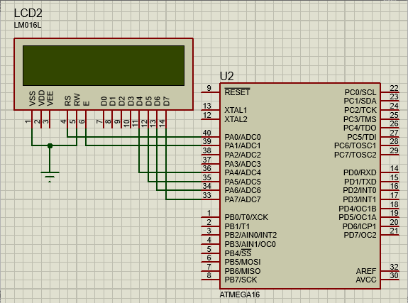

# Hello World

### Question
In this part, implement the famous "Hello World" program on the LCD. To do this, you can access the LCD library, which contains all the LCD commands and uses the functions.

### RESULT

