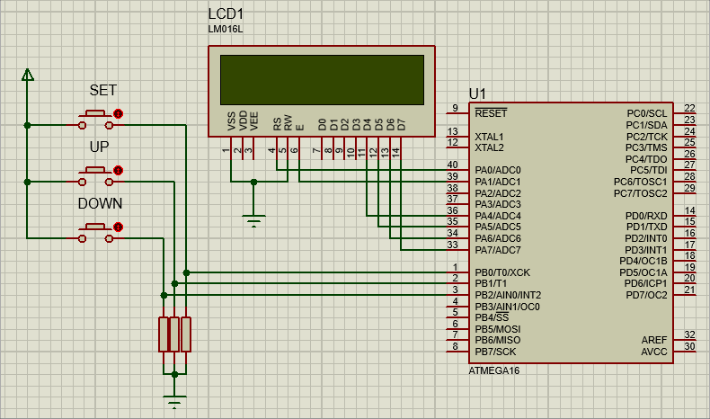

# Digital Clock

### Question
Design a digital clock using Timer 2. Your digital clock should display hours, minutes and seconds and work very accurately (without using the delay function). Also, you can add the clock setting buttons.

### RESULT

