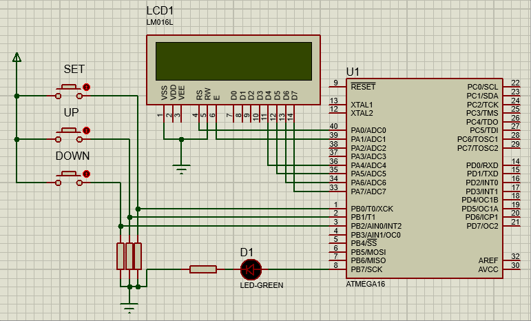

# Alarm

### QUESTION
By using Timer 1, implement the alarm structure in your digital clock. An alarm is a timer that displays a text on an LCD after a period of time; specified by the user and turns on an LED. Your alarm should be configurable.

### RESULT

